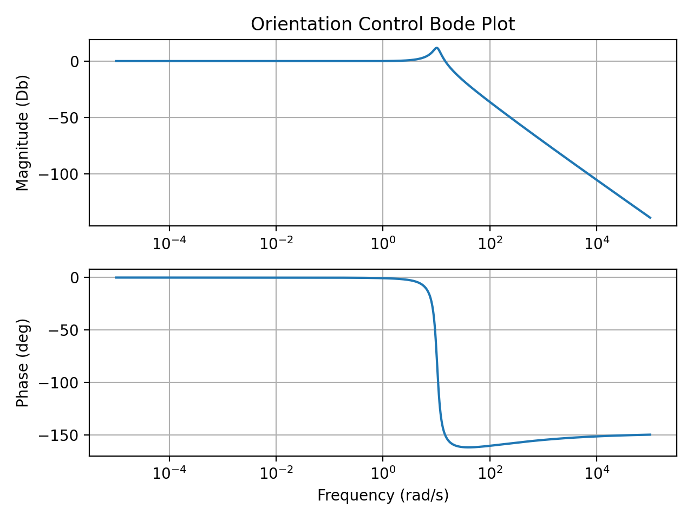
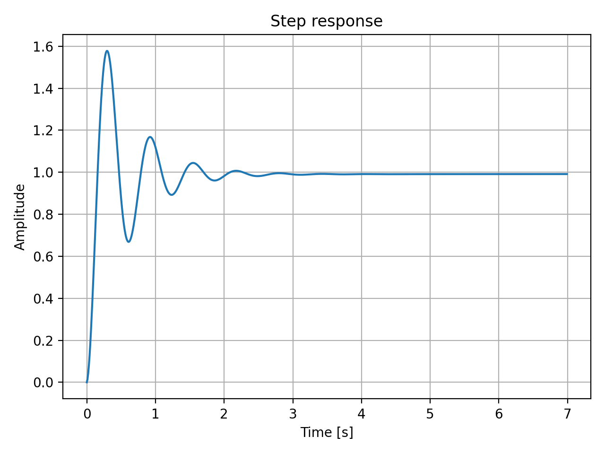

# FOMCONpy
FOMCONpy is a new fractional-order modelling and control toolbox for Python. It is an extension of the existing FOMCON toolbox for MATLAB, but this time aiming at Python users and the Internet of Things (IoT) community. Just like the original toolbox, it offers a set of tools for researchers in the field of fractional-order control.

This toolbox is dependent on control 0.8.1 library for python (https://python-control.readthedocs.io/en/0.8.1/intro.html). Other dependencies include pyqt5, numpy, scipy, pandas, xlrd and slycot (https://github.com/python-control/Slycot).
if you are using a windows OS you might have challenges installing slycot because there will be need to install a fotran compiler to build slycot from the repository.

recommended fotran compiler is Intel Math Kernel Library 2019.0.117, it works perfectly with anaconda 2019.3

Python environment used for this development is anaconda 2019.3, but pycharm should word perfectly. The "environment.uml" file contains the python library packages used in the development of this software. 

# Setup guide for Windows
- item Install Anaconda.
- Install Git.
- Navigate using the command prompt to any desired directory of choice
- Clone FOMCONpy from its repository(git clone https://github.com/outstandn/fomcon.git).
- Change current working directory to "fomconpy": cd fomcon
- Create "fomcon" environment: conda env create -f environment.yml
- Activate fomcon environment: conda activate fomcon

# Setup guide for Linux
Open a terminal and enter the following commands:
- sudo apt-get install git python3-pyqt5 python3-numpy python3-scipy python3-pandas python3-xlrd python3-matplotlib python3-pip python3-select
- pip3 install control addict
- Navigate using the command prompt to any desired directory of choice
- Clone FOMCONpy from its repository(git clone https://github.com/outstandn/fomcon.git).
- Change current working directory to "fomconpy": cd fomcon

# Using Fomconpy's GUI
The FOMCONpy has three modules

## Fractional-Order System Analysis Module
The fractional-order system viewer can be accessed by starting a command prompt, navigating to the directory of your downloaded source, then run the follwoing command:
- python pyfomcon.py

## Fractional-Order System Identificaiton Module
The identification tool can be accessed by starting a command prompt, navigate to the directory of your downloaded FOMCONpy source code, then run the following commands:
- python pyfotfid.py

## Fractional-Order System Control Module
The tool can be accessed by starting two command prompt, navigate to the directory of your downloaded FOMCONpy source code, then run the following commands:
- python pyfopidopt.py

Open another command prompt, navigate to the directory of your downloaded FOMCONpy source code, then run the following command to start teh Destributed Control Server: 
- python controlServer.py

# How to use without the GUI
In certain situations, you may want to use the scripts included in this library without the GUI. Here are some examples on how to do that.
```
import fotf
%matplotlib inline
import numpy as np
import matplotlib.pyplot as plt
import control

import warnings
warnings.filterwarnings('ignore')

p_coef = 50
i_coef = 30
d_coef = 20
lambda_coef = 0.25
epsilon_coef = 0.35
FOPID_TF = fotf.FOTransFunc([d_coef, p_coef, i_coef], [epsilon_coef + lambda_coef, lambda_coef, 0], [1, 0], [lambda_coef, 0], 0) # Fractional Order PID
G_TF = fotf.FOTransFunc([1], [0], [1, 1, 1], [2, 1, 0], 0) # Sample System
H_TF = fotf.FOTransFunc([1], [0], [1], [0], 0) # Unit feedback
SYSTEM_TF = (FOPID_TF * G_TF).feedback(H_TF)
rmagDb, rangleCalcDeg, w  = SYSTEM_TF.freqresp()
t = np.arange(0, 7, 0.01)
y = SYSTEM_TF.step(t = t, plot=False)
```

Now you can simply draw the plots using matplotlib library:
```
plt.rcParams['figure.dpi'] = 200
rmagDb, rangleCalcDeg, w = SYSTEM_TF.freqresp()
plt.subplot(2, 1, 1)
plt.semilogx(w, rmagDb)
plt.ylabel('Magnitude (Db)')
plt.title('Orientation Control Bode Plot')
plt.grid(True, axis='both', which='both')
plt.subplot(2, 1, 2)
plt.semilogx(w, rangleCalcDeg,)
plt.xlabel('Frequency (rad/s)')
plt.ylabel('Phase (deg)')
plt.grid(True, axis='both', which='both')
plt.tight_layout()

plt.subplot(2, 1, 2)
t = np.arange(0, 7, 0.01)
y = SYSTEM_TF.step(t = t, plot=False)
plt.figure()
plt.plot(t, y)
plt.title('Step response')
plt.xlabel('Time [s]')
plt.ylabel('Amplitude')
plt.grid()
plt.tight_layout()
```
Here are the outputs:



Note that there are some considerations. For instance, you need to give all the numerator and denominator coefficients in a decreasing order. Plus, you cannot give float values out of the [0,1] range. Finally, you may need to provide coefficients even for powers of s that don't exist (obviously as 0).
